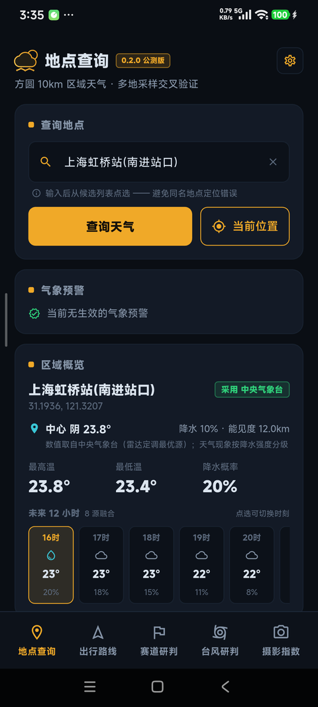
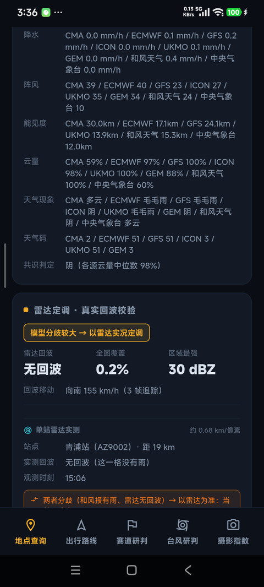
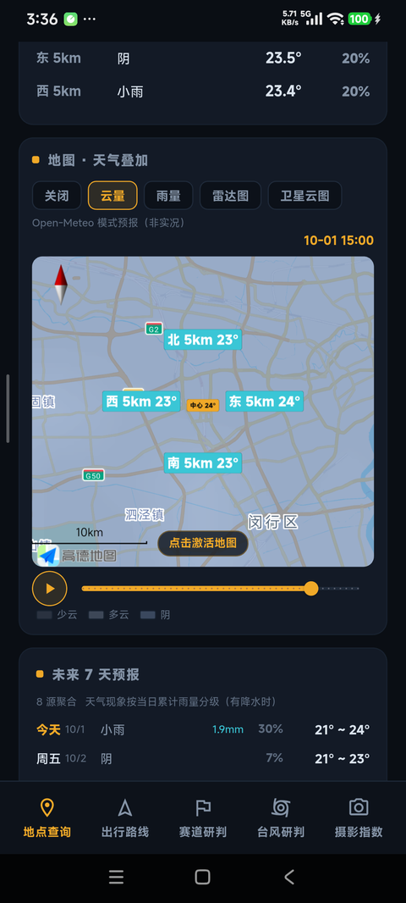
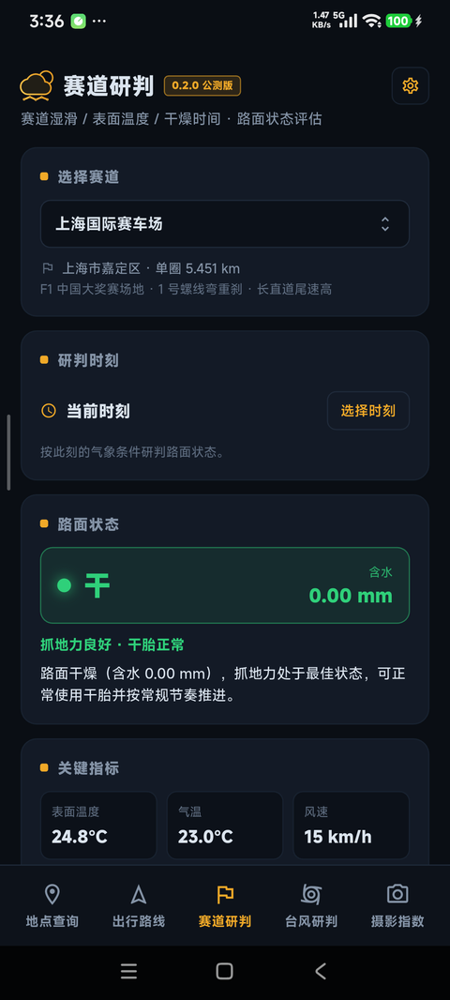
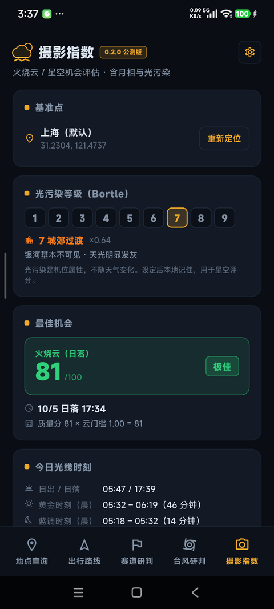
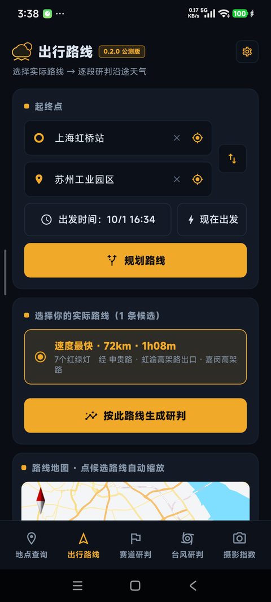
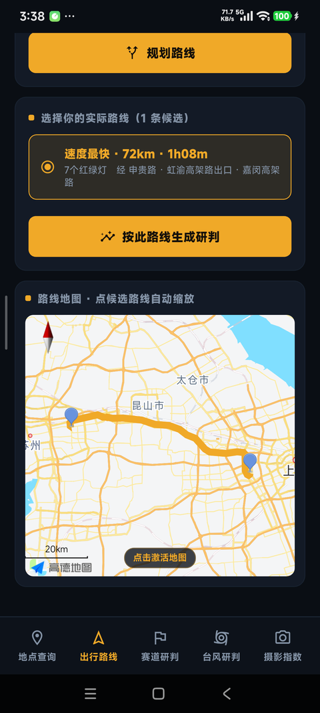
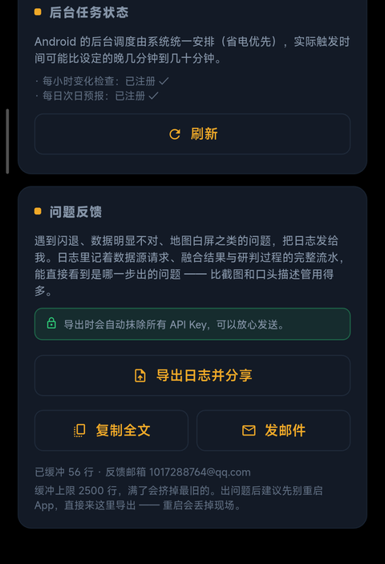

# 迹时天气 (jishiweather)

> 本地化出行天气研判 —— 航空级多源聚合天气简报，**纯本地计算**，不依赖任何自建服务器。

输入出发地 / 目的地 / 时间，沿你**实际要走的路线**逐段研判天气：哪段有雨、几点下、路面湿滑风险，给出绿 / 黄 / 红出行建议。

**下载：[最新版本见 Releases](../../releases)**

---

## 目录

- [功能](#功能)
- [界面预览](#界面预览)
- [下载安装](#下载安装)
- [教程一：怎么申请 API Key](#教程一怎么申请-api-key)
- [教程二：怎么用这个 App](#教程二怎么用这个-app)
- [数据源与额度](#数据源与额度)
- [问题反馈](#问题反馈)
- [隐私](#隐私)
- [许可](#许可)

---

## 功能

五个功能页，底部导航切换：

- **地点查询**：方圆 10km 区域天气（中心 + 4 方位采样点交叉验证）→ **8 源逐小时融合**（Open-Meteo 6 个数值模型 CMA / ECMWF / GFS / ICON / UKMO / GEM + 和风天气 + 中央气象台实况）→ 逐小时条**可点选联动**（区域概览 / 采样点明细 / 多源研判 / 雷达外推四处同步切换）→ 7 天预报（本地多源聚合）
- **出行路线**：高德规划返回**多条候选路线** → 由你选定实际要走的那条 → 每 10km 采样 → 按到达时刻取天气 → 天气突变点自动切段 → 逐段研判 + 整体建议等级；并做**台风 × 路线重叠分析**（±6h 时间窗、受影响路段、机构分歧）
- **赛道研判**：预置赛道坐标库（国内 13 + 海外 8）→ **研判时刻可选**（当前 / 指定时刻）→ 路面**含水模型**（过去 6h 降水 − 蒸散 + 当前雨强×0.5）→ 分级（干/微湿/湿/积水）+ **表面温度** + **预计干燥时间** + **多源参考**（8 源并列 + 降水分歧）+ **Ventusky 坐标核对**
- **台风研判**：中央气象台台风网实况路径 + **多机构预报** → 按**预报路径最近距离 + 7 级风圈 + 强度**给出本地影响等级（无影响/关注/警戒/严重影响）
- **摄影指数**：**火烧云**（日落/日出）与**星空**机会评分（0~100）。**三层乘法模型** —— 先判断「地面能否看到天」（总云量门槛，阴天直接否决），再算质量分；星空另有**月光因子**（月明星稀）、**光污染 Bortle 因子**（机位可设、本地记忆）与「万里无云」级别的严苛云门槛；空气质量用 **AOD（气溶胶光学厚度）**；另附**今日光线时刻**（黄金/蓝调/月出月落）与**未来 7 天趋势**

另有：

- **气象预警**：地点查询页置顶展示本区县/本市生效预警（中央气象台预警接口，按行政区划码过滤）
- **雷达回波外推**：以运动矢量外推未来 2 小时回波，超出范围时明确标注
- **卫星云图 / 雷达拼图叠加**：风云四号真彩云图与中央气象台雷达拼图可叠加在地图上
- **使用当前位置**：一键定位（室内信号弱时有超时兜底）

---

## 界面预览

| 地点查询 · 区域概览                               | 多源研判 · 8 源逐项对照                               |
| ----------------------------------------- | -------------------------------------------- |
|  |  |

| 地图 · 天气叠加（云量）                                | 赛道研判 · 路面含水与表温                         |
| -------------------------------------------- | -------------------------------------- |
|  |  |

| 摄影指数 · 火烧云机会                           | 出行路线 · 候选与逐段研判                         |
| -------------------------------------- | -------------------------------------- |
|  |  |

| 出行路线 · 沿途地图                                | 问题反馈 · 日志导出                               |
| ------------------------------------------ | ----------------------------------------- |
|  |  |

---

## 下载安装

到 [Releases](../../releases) 下载最新 APK：

| 文件                          | 适用机型                     |
| --------------------------- | ------------------------ |
| `jishi-weather-<版本>-arm64.apk`       | **绝大多数手机**（近 8 年的机型都选这个） |
| `jishi-weather-<版本>-armeabi-v7a.apk` | 老旧 32 位机型                |

拷到手机点击安装即可（需允许「安装未知来源应用」）。
每个版本都附 SHA256 校验值，可用 `Get-FileHash <文件> -Algorithm SHA256` 核对。

> **首次打开务必先填 Key** —— 不填的话地点查询和路线规划用不了（详见下面的教程一）。

---

## 教程一：怎么申请 API Key

App 的地图与地点搜索依赖高德，和风天气是可选增强源。
三样东西免费申请、个人开发者用完全够：高德 **Web服务 Key**、高德 **Android 平台 Key**、
和风 **Key + 专属 API Host**（和风要两项，缺一不可）。

### 1. 高德 Web服务 Key（地理编码 + 路线规划）

1. 打开 <https://lbs.amap.com/>，注册账号并完成**个人开发者实名认证**（控制台会提示，微信/支付宝扫脸即可，几分钟）。
2. 进入 **控制台 → 应用管理 → 我的应用 → 创建新应用**。名称随便填，比如 `jishi-weather`，类型选「出行」。
3. 在刚创建的应用下点 **添加 Key**：
   - **Key 名称**：`jishi-web`
   - **服务平台**：选 **Web服务**
   - 不填包名、不填 SHA1（Web服务 Key 不需要）
   - 勾选同意协议 → 提交
4. 页面上会出现一串 **32 位字符串**，这就是 `amapWebKey`。

### 2. 高德 Android 平台 Key（地图显示 + 在线定位）

1. 同一个应用下，**再点一次「添加 Key」**：
   - **Key 名称**：`jishi-android`
   - **服务平台**：选 **Android 平台**
   - **发布版安全码 SHA1**：见下方「怎么拿到 SHA1」
   - **PackageName**：`com.lingxi.jishiweather`
   - 提交
2. 得到第二串 32 位字符串，这就是 `amapAndroidKey`。

> **同一个 Key 可以登记多个 SHA1**：把调试版和发布版的 SHA1 都填进去（用 `;` 分隔），这样 debug 包和 release 包都能用地图与定位。

#### 怎么拿到 SHA1

**如果你用的是别人编译好的 APK**：直接用 App 内置的值 —— 打开「设置 → API Key」，在「② 高德 Android 平台 Key」下方有一行**签名 SHA1**，点右侧「复制」即可。

**如果你自己编译**：

```bash
# 方式一：从已构建的 APK 里读（推荐，拿到的就是实际签名）
apksigner verify --print-certs build/app/outputs/flutter-apk/app-release.apk

# 方式二：从密钥库读
keytool -list -v -keystore release.keystore -alias jishiweather

# 调试签名（Android Studio 默认）
keytool -list -v -keystore ~/.android/debug.keystore -alias androiddebugkey -storepass android
```

> ⚠️ **不要用 `keytool -printcert -jarfile <apk>`** —— 现代 APK 只做 v2/v3 签名，而 keytool 只认 v1 的 JAR 签名，会报「不是签名的 jar 文件」。

#### 申请 Android Key 时最常见的两个报错

| 现象                           | 原因                                                       |
| ---------------------------- | -------------------------------------------------------- |
| 地图白屏，日志 `INVALID_USER_SCODE` | SHA1 或包名不匹配（多半填了调试版 SHA1 但装的是发布包，或包名写错）                  |
| `USERKEY_PLAT_NOMATCH`       | 服务平台选错了 —— 把「Web服务」的 Key 拿去给 Android SDK 用了（两个 Key 不能混用） |

### 3. 和风天气 Key（可选）

1. 打开 <https://dev.qweather.com/>，注册并登录。
2. **控制台 → 项目管理 → 创建项目**（免费订阅即可）。
3. 进入项目 → **创建凭据 → 选「API KEY」**，得到一串 Key。
4. **在同一个页面复制「API Host」**，形如 `abcdefg.re.qweatherapi.com`（每个账号不同）。

> ⚠️ 2024 年改版后，旧的公共域名 `devapi.qweather.com` / `api.qweather.com` 对新用户已停用。
> **必须同时填 Key 和专属 API Host，两个都填才生效**；缺一个就自动跳过和风源（其余 6 个源不受影响）。

### 4. 填进 App

打开 App → 底部导航「设置」→ **API Key · 数据源配置**：

| 输入框                 | 填什么               |
| ------------------- | ----------------- |
| ① 高德 Web服务 Key      | 第 1 步拿到的 32 位字符串  |
| ② 高德 Android 平台 Key | 第 2 步拿到的（留空则用内置的） |
| ③ 和风天气 API Key      | 第 3 步拿到的          |
| ④ 和风天气专属 API Host   | 第 3 步复制的域名        |

点「保存并生效」。**②这一项改完需要重启 App** —— 地图 SDK 只在启动时初始化一次。其余三项立即生效。

---

## 教程二：怎么用这个 App

### 第一次打开

1. 允许定位权限（用于「使用当前位置」；不给也能用，手动搜地点即可）。
2. 允许通知权限（只有你要开天气提醒时才需要）。
3. 如果这是**公测版**，先去「设置」填上你自己的高德 Web服务 Key —— 不填的话地点查询与路线规划不可用（地图显示和定位仍可用）。

### ① 地点查询

- **输入地点**：顶部搜索框输入城市/区县/地标名，或点「使用当前位置」。
- **看逐小时**：横向的逐小时条可以**点选某一小时**，下方四个面板会同步切换到该小时：
  - **区域概览** —— 中心点 + 4 个方位采样点（东西南北各 10km）的天气，用来看「这一片是晴是雨」
  - **采样点明细** —— 5 个点的逐项数值对照
  - **多源研判** —— 7 个数据源各自的预报 + 均值 + 极差（分歧大 = 不确定性高）
  - **雷达外推** —— 未来 2 小时回波走向
- **看预警**：若本区县/本市有生效预警，会置顶显示（红色优先）。
- **看 7 天**：下方 7 天预报为本地多源聚合结果。
- **图层**：地图上可叠加风云四号卫星云图、中央气象台雷达拼图。

### ② 出行路线

1. 填**出发地**、**目的地**、**出发时间**（可选「现在」或指定时刻）。
2. 高德会返回**多条候选路线**（高速优先 / 距离最短等）→ **点选你实际要走的那条**。
3. App 沿路线**每 10km 取一个采样点**，按**到达该点的时刻**取天气（不是出发时刻，这点很关键 —— 一趟 2 小时的车程，终点和起点差 2 小时）。
4. **天气突变点自动切段**：沿线天气明显变化处会断开成若干段，每段单独研判。
5. 结果给出**整体建议等级**（绿 / 黄 / 红）与逐段说明。
6. 若附近有台风，会额外做**台风 × 路线重叠分析**：±6 小时时间窗内，哪些路段会受影响、各机构预报分歧多大。

### ③ 赛道研判

1. 从预置赛道库选择（国内 13 条 + 海外 8 条），或直接输入坐标。
2. 选择**研判时刻**：当前，或未来某个指定时刻（例如「明天下午 3 点跑圈」）。
3. 输出：
   - **路面含水模型**：`过去 6h 降水 − 蒸散 + 当前雨强 × 0.5`
   - **分级**：干 / 微湿 / 湿 / 积水
   - **表面温度**（不是气温 —— 沥青在太阳下会明显高于气温）
   - **预计干燥时间**
   - **多源参考**：ECMWF / GFS / ICON / 和风并列，并标出降水分歧
   - **Ventusky 坐标核对**：一键跳到 Ventusky 看同坐标的实况图

### ④ 台风研判

- 中央气象台台风网的**实况路径** + **多机构预报路径**。
- 按「预报路径离你最近距离 + 7 级风圈半径 + 强度」给出本地影响等级：**无影响 / 关注 / 警戒 / 严重影响**。
- 会显示机构分歧 —— 分歧大时别只看结论。

### ⑤ 摄影指数

- **火烧云**（日落 / 日出）与**星空**评分，0~100。
- **三层乘法模型**：先判断「地面能否看到天」（总云量门槛，阴天直接否决）→ 再算云的质量分 → 星空再乘**月光因子**与**光污染（Bortle）因子**。
- 空气质量用 **AOD（气溶胶光学厚度）**，比 PM2.5 更能反映「天够不够透」。
- 提供**今日光线时刻**（黄金时刻 / 蓝调时刻 / 月出月落）与**未来 7 天趋势**。
- 光污染等级可手动设置，本地记忆。

### 设置页

- **天气提醒**：每小时变化提醒（天气现象 / 气温 / 降水概率 / 雨强有明显变化时才通知）、每日次日预报推送（约 24:00）。
- **提醒地点**：默认跟随定位，可点「用当前位置」重设；下方会显示最近雷达站与距离。
- **立即检查一次**：手动触发一次提醒检查，用来验证推送通道。
- **API Key**：四个输入框（高德 Web / 高德 Android / 和风 Key / 和风 Host）的填写与今日额度查看。
- **后台任务状态**：显示系统实际注册了哪些后台任务，便于排查「到底有没有生效」。
- **问题反馈**：导出运行日志发给我（**自动抹除所有 API Key**，可放心发送），
  详见 [问题反馈](#问题反馈) 一节。

> Android 的后台调度由系统统一安排（省电优先），实际触发时间可能比设定晚几分钟到几十分钟，属正常现象。

---

## 数据源与额度

| 数据源                                                            | 用途                                                                                | Key     | 免费额度              |
| -------------------------------------------------------------- | --------------------------------------------------------------------------------- | ------- | ----------------- |
| [Open-Meteo](https://open-meteo.com/)                          | 逐小时气象主源（ECMWF / GFS / ICON / CMA / UKMO / GEM 六模型）；ET0 / 短波辐射 / 分层云量 / 能见度 / 日出日落 | 免 key   | 非商业用途免费           |
| [中央气象台](http://www.nmc.cn/)                                    | 站点实况（过去 24h 逐小时）、7 天预报、**气象预警**、雷达拼图                                              | 免 key   | 无公开限制             |
| [中央气象台台风网](http://typhoon.nmc.cn/)                             | 台风实况路径 + 多机构预报（国内直连，响应 ~0.1s）                                                     | 免 key   | 无公开限制             |
| [风云四号卫星](http://www.nmc.cn/publish/satellite/fy4b-visible.htm) | FY-4B 真彩云图（30 分钟一张）                                                               | 免 key   | 无公开限制             |
| [RainViewer](https://www.rainviewer.com/)                      | 雷达瓦片（任意缩放）                                                                        | 免 key   | 免费层               |
| [和风天气](https://www.qweather.com/)                              | 国内逐小时（第 7 源）、分钟级降水、气象预警                                                           | **需自备** | 免费订阅 **1000 次/天** |
| [高德开放平台](https://lbs.amap.com/)                                | 地理编码、驾车路线规划、地图显示、混合定位                                                             | **需自备** | 按账号配额，见下          |

高德需要**两个** Key，服务平台不同、用途不同：

| Key 类型         | 用途                 | 是否绑定包名/SHA1 | 示例配额（个人认证开发者，以官网为准）          |
| -------------- | ------------------ | ----------- | ---------------------------- |
| **Web服务**      | 地理编码、路线规划、静态地图     | 否           | 「基础地图定位服务」150 万次/月（账号级共享）    |
| **Android 平台** | 地图 SDK 显示、在线定位 SDK | **是**       | 同上；且**地图图面渲染不计费**，只有「在线定位」计数 |

> ⚠️ 配额数字随官方政策变化，请以高德控制台的用量页为准。
> ⚠️ 地图**拖动/缩放/叠加层完全不消耗配额** —— 高德计费表里没有「图面渲染」这一项（Android 地图 SDK 是本地渲染）。

---

## 问题反馈

遇到闪退、数据明显不对、地图白屏之类的问题，**把日志发给作者**。
日志里记着数据源请求、融合结果与研判过程的完整流水，能直接看到是哪一步出的问题 —— 比截图和口头描述管用得多。

App 从启动起就在内存里滚动保留最近 **2500 行**自身日志（日志在内存里，**重启就没了**，所以出问题后先去导出）：

1. 打开「设置 → 问题反馈」
2. 点 **导出日志并分享** → 在分享面板里选「电子邮件」或「QQ 邮箱」，日志文件会自动作为附件
3. 收件人填 **1017288764@qq.com**，补一句你在哪个页面、做了什么操作、期望看到什么

也可以直接点卡片上的 **发邮件**，App 会拉起邮件应用并预填好收件人与主题；
分享面板不好使时还有 **复制全文** 可以把日志整段贴进邮件正文。

> 🔒 **导出文件会自动抹除所有 API Key**，可以放心发送。

---

## 隐私

- 定位数据仅用于本地天气查询，**不上传**到任何自建服务器
- 无账号系统、无埋点统计
- Key 只存放在本机 `SharedPreferences`，不随任何请求外发给第三方
- 高德 SDK 合规：地图初始化遵循高德隐私合规要求（先声明隐私政策已展示并获用户同意）

---

## 许可

**Business Source License 1.1**（见 [LICENSE](LICENSE)）

- ✅ 个人、教育、研究、评估用途**免费**
- ⚠️ **生产环境使用、商业使用、或作为服务提供给第三方需获得商业授权**
- 📅 2030-09-16 起自动转为 **Apache License 2.0**

> 简言之：源码公开可读可学、个人免费用；想商用请联系作者。
> 商业授权咨询：欢迎开 Issue 联系。

---
